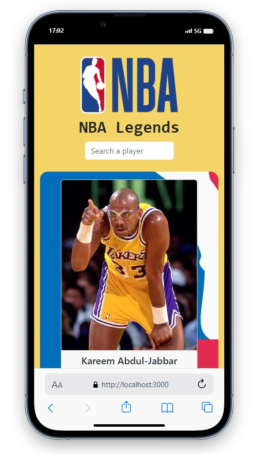

# NBA Legends

<div align="center">
  
</div>

## About the Project

This project is a simple web application that displays information about NBA legends. The application is developed using React and Bootstrap technologies.

## Live Project Link

You can access the live version of the project [here]().

## Project Skeleton

```
NBA Legends(folder)
|
|----readme.md       
SOLUTION
├── public
│     └── index.html
├── src
│    ├── components
│    │       ├── Header.jsx
│    │       ├── CardContainer.jsx
│    │       └── PlayerCard.jsx
│    ├── helper
│    │       └── data.js
│    ├── assets
│    │       └── [images]
│    ├── App.js
│    ├── index.js
│    └── index.css
├── package.json
└── yarn.lock
```

## Screenshots

<div align="center">
  
  
  
</div>

## Compatibility

The project is compatible with both wide-screen computers and mobile devices.